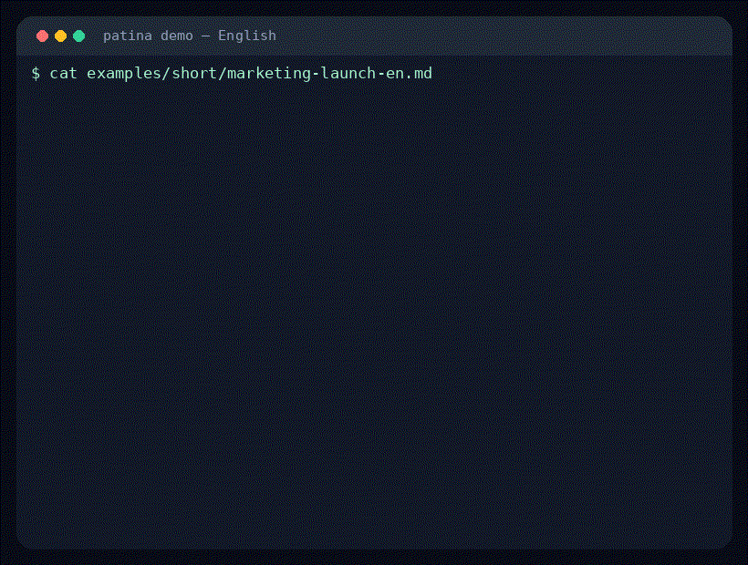

<p align="center">
  
</p>

<h1 align="center">patina</h1>

<p align="center">
  <strong>Strip the AI packaging. Keep the meaning.</strong>
</p>

<p align="center">
  <a href="README_KR.md"><b>한국어</b></a> ·
  <a href="README_ZH.md"><b>中文</b></a> ·
  <a href="README_JA.md"><b>日本語</b></a> ·
  <b>English</b>
</p>

<p align="center">
  <a href="https://github.com/devswha/patina/actions/workflows/test.yml"></a>
  <a href="https://opensource.org/licenses/MIT"></a>
  <a href="#quick-start"></a>
  <a href="https://github.com/devswha/patina"></a>
  <a href="CHANGELOG.md"></a>
</p>

<p align="center">
  <a href="https://patina.vibetip.help/"><b>▶ Try it now on your own text — no install</b></a>
</p>

patina looks for AI-sounding patterns in Korean, English, Chinese, and Japanese, then rewrites them without changing the claim, numbers, polarity, or causation. Use it as a skill for [Claude Code](https://docs.anthropic.com/en/docs/claude-code), [Codex CLI](https://github.com/openai/codex), [Cursor](https://cursor.sh), and OpenCode, or run it as a standalone Node.js CLI.

It is not a black-box rewriting tool or an AI-detector bypass tool. patina is **clearly pattern-based and auditable**: it shows what changed, why it changed, and whether the original claims were preserved. No API key is needed when any of the `codex`, `claude`, or `gemini` CLIs is already logged in.

## Demo

**Before** *(AI-sounding)*:
> Coffee has emerged as a **pivotal cultural phenomenon** that has **fundamentally transformed** social interactions across the globe. This beloved beverage serves as a catalyst for community building, fosters meaningful connections, and facilitates cross-cultural dialogue.

**After** *(`/patina --lang en` — same claims, AI packaging removed)*:
> Coffee has quietly changed how people meet. Sit across from someone long enough, and something like a real connection tends to form — even between people from very different cultures.

> **MPS = 100** · cultural transformation ✓ · community building ✓ · meaningful connections ✓ · cross-cultural dialogue ✓

**More demo slices**

| Input type | AI packaging removed | Preserved meaning |
|---|---|---|
| Korean marketing | “혁신적인 솔루션”, “새로운 패러다임” | 30 Notion templates, workflow fit, copy-and-edit usage |
| Academic | “획기적인 성과”, broad significance claims | 60 GitHub projects, 72h→10m setup time, p<0.01, limits noted |
| Technical | “핵심적인 역할”, future-standard hype | GPU management, one-command provisioning, 5× result caveat |

**See it run** *(English)*:

<p align="center">
  
</p>

## Try it in your browser — no install

**[patina.vibetip.help](https://patina.vibetip.help/)** scores KO / EN / ZH / JA paragraphs for AI-writing patterns, right in the browser.

> **Audit-only.** The playground runs deterministic stylometry inside your browser. It does not rewrite text, call an external LLM, or send API keys to a server. Use the CLI or skill below when you want a rewrite.

Try the full rewrite locally: [30-second terminal demo](docs/DEMO.md). More examples: [Before/After Gallery](docs/EXAMPLES.md) ([한국어](docs/EXAMPLES_KR.md)).
Brand resources: [logo](assets/brand/patina-logo.svg), [mark](assets/brand/patina-mark.svg), [icon](assets/brand/patina-icon.svg), [social preview](assets/social/patina-og.svg), and [before/after card](assets/social/patina-before-after.svg). Usage guidelines: [BRANDING.md](docs/BRANDING.md).

## At a Glance

|  |  |
|---|---|
| **168 patterns** | 33 rewrite-capable + 9 score-only viral-hook per language (42 each across KO/EN/ZH/JA) — see [PATTERNS.md](docs/PATTERNS.md) |
| **Editing hotspot recall** | 2026-05-22 modern-model rebaseline: 67.3% overall catch [63.5–71.0%] across GPT-5.5 / Claude Sonnet 4.6 / Gemini 2.5 Pro (n=600, KO+EN) |
| **Benchmark reports** | Reproducible ko/en/zh/ja suspect-zone benchmark: [overview](docs/benchmarks/README.md) · [latest.md](docs/benchmarks/latest.md) · [latest.json](docs/benchmarks/latest.json) · [2026 rebaseline](docs/benchmarks/rebaseline-latest.md) · [detector comparison](docs/benchmarks/detector-comparison.md) |
| **False positives** | 16.0% [11.6–21.7%] on 2026-05-22 KO+EN human controls (n=200); register boundaries remain documented in [stylometry.md](core/stylometry.md) — [report one](https://github.com/devswha/patina/issues/new?template=false_positive.yml) |
| **Modes** | rewrite · audit · score · diff · ouroboros |
| **Free tier** | Yes — via logged-in `codex`, `claude`, or `gemini` CLI (no API key) |
| **Determinism** | Scoring formula is deterministic; LLM severity assignment ±8–10 pt per run ([scoring.md §8](core/scoring.md)) |
| **License** | MIT |

## Quick Start

### As a Claude Code or Codex CLI skill

```bash
curl -fsSL https://raw.githubusercontent.com/devswha/patina/main/install.sh | bash
```

The installer wires patina into Claude Code, [Codex CLI](https://github.com/openai/codex), Cursor, and OpenCode. It resolves the repository HEAD to a concrete commit before checkout; set `PATINA_REF=<tag-or-full-sha>` when you need a fully pinned install. Then:

```
/patina --lang en

[paste your text here]
```

Rewrite with a specific tone:

```
/patina --tone narrative

[paste your essay draft here]
```

Auto-detect and apply the best-fit tone:

```
/patina --tone auto --lang en

[paste your text here]
```

### As a standalone CLI

Requires Node.js ≥ 18. The npm package is public, so you can run it directly:

```bash
npx patina-cli init --defaults
npx patina-cli doctor
npx patina-cli --lang en input.txt
```

When you want to hack on the repo:

```bash
git clone https://github.com/devswha/patina.git
cd patina && npm install && npm link
patina --lang en input.txt
```

Or try stdin after linking:

```bash
printf '%s\n' 'Coffee has emerged as a pivotal cultural phenomenon that has fundamentally transformed social interactions across the globe.' \
  | patina --lang en --backend codex-cli
```

> 🆓 **No API key required** if you have any of [`codex`](https://github.com/openai/codex), [`claude`](https://docs.anthropic.com/en/docs/claude-code), or [`gemini`](https://github.com/google-gemini/gemini-cli) CLIs logged in. Pick one with `--backend codex-cli | claude-cli | gemini-cli`, declare an explicit fallback chain such as `--backend claude-cli,codex-cli`, or let the model heuristic route automatically (`--model claude-*` → claude-cli, etc.). See [AUTHENTICATION.md](docs/AUTHENTICATION.md) for the full backend list.

### CI integrations

Patina also ships a no-key, deterministic CI check for prose review:

```yaml
# .github/workflows/patina.yml
name: Patina prose score

on:
  pull_request:
    paths:
      - '**/*.md'
      - '**/*.mdx'

permissions:
  contents: read
  pull-requests: read
  issues: write

jobs:
  patina:
    runs-on: ubuntu-latest
    steps:
      - uses: actions/checkout@v6
      - uses: devswha/patina-action@v1
        with:
          score-threshold: 30
          lang: auto
          comment: true
```

Docker image publishing is tracked separately from the npm release path. Until
the GHCR image is published, build the local image when you need a container:

```bash
docker build -t patina:local .
printf '%s\n' 'Coffee has emerged as a pivotal cultural phenomenon.' \
  | docker run --rm -i -e PATINA_API_KEY patina:local --lang en --provider openai
```

Pre-commit, Husky, Lefthook, Docker, and release workflow notes live in [docs/integrations/](docs/integrations/).

## Intended Use

Use Patina when an author is allowed to draft with AI and wants to edit the result, understand what changed, and make the voice read more naturally. It does not certify that text was “originally human,” and it should not be used for academic honor-code evasion, publisher disclosure circumvention, plagiarism laundering, or detector-bypass claims. Scores are editing signals with false positives and false negatives, not authorship proof. See [ETHICS.md](docs/ETHICS.md).

## Modes

```
patina --lang <ko|en|zh|ja> [mode] [--profile <name>] input.txt
```

| Flag | What it does |
|------|-------------|
| *(default)* | Rewrite |
| `--audit` | Detect AI patterns only |
| `--score` | 0–100 AI-likeness score with category breakdown |
| `--score --exit-on <n>` | Keep CI strict: exit code `3` when `overall > n` (`--gate` is kept as an alias) |
| `--diff` | Show changes pattern by pattern |
| `--ouroboros` | Iterate the rewrite until score converges (with MPS rollback) |
| `--lang <ko\|en\|zh\|ja>` | Select language (default: `ko`) |
| `--profile <name>` | Tone preset: `blog`, `academic`, `technical`, `formal`, `social`, `email`, `legal`, `medical`, `marketing`, `narrative`, `instructional`, `casual-conversation`, `code-comment`, `commit-message`, `release-notes`, `namuwiki` |
| `--tone <name>` | Tone category: `casual`, `professional`, `academic`, `narrative`, `marketing`, `instructional`, `auto` |
| `--batch` | Treat positional args as a list of files (e.g. `--batch docs/*.md`) |
| `--format json\|text\|markdown` | Select machine-readable JSON, plain text, or default Markdown output |
| `--quiet` | Suppress status, warning, and progress logs on stderr |
| `--json-logs` | Emit stderr logs as NDJSON with `level`, `event`, `model`, and `latency_ms` fields |
| `--prompt-mode strict\|minimal\|auto` | Choose full pattern-pack prompting, compressed prompting, or backend-aware auto |
| `--variants <1-5>` | Generate multiple rewrite variants with the same facts and meaning anchors |
| `--card <path>` | Write a 1200×630 SVG before/after card with AI score and MPS |

`patina --help` for the full flag list. `patina doctor --json` checks Node/backend/tmux/API-key readiness without making an LLM call, and `patina init` writes a project `.patina.yaml`.

Dev-native profile shortcuts are available for Markdown-heavy engineering workflows:
`code-comment` tightens inline comments/docstrings, `commit-message` rewrites Git history text around intent and verification, and `release-notes` turns changelog bullets into user-impact notes with migration risks visible. `namuwiki` is a ko-only, license-safe wiki-style profile that uses original guidance only; it does not copy NamuWiki article text.

### Score-only patterns

`--score` and `--audit` measure a slightly broader set of signals than `--rewrite` does. The viral-hook packs (`ko/en/zh/ja-viral-hook`, 9 patterns each: shock-number hooks, clickbait closings, source-skipping authority claims, breath-optimized short-sentence stacking, hyperbolic engagement lexicon, fake-stat citations, stacked credentials, future-self/parasocial promises, aphoristic punchlines) are **detection-only**.

They appear in score and audit output so the benchmark matches human intuition for SNS-style marketing copy across all four languages. `--rewrite`/`--diff`/`--ouroboros` skip them because those signals are often intentional rhetoric. Real-world demos: [`examples/viral-hook/`](examples/viral-hook/).

### Prompt-mode tuning (v3.11)

`--prompt-mode strict|minimal|auto` lets you trade off between the full pattern packs (~34KB structured prompt) and a compressed casual instruction (~3KB). `auto` picks per backend — Gemini does better on minimal (it gets over-constrained by long structured prompts), while Claude leverages the full packs and Codex is roughly insensitive. Standalone CLI MAX rewrite workers default to `minimal` unless `--prompt-mode` or config overrides it, so multi-candidate runs stay light by default; in MAX, `auto` resolves once before dispatch rather than separately per candidate. case-05 documents the A/B.

### Multiple stylistic variants (v3.11)

`--variants <1-5>` asks for several tone variants in one call (e.g., V1 casual, V2 direct, V3 measured) — facts, numbers, and causation stay identical across variants. Each comes back as `## Variant N` so you can pick the voice you want.

### Short-text scoring boost (v3.11)

For inputs ≤200 chars or ≤3 paragraphs, register-sensitive categories (`language`, `style`, `viral-hook`) get a 1.5× severity multiplier so single-paragraph voice shifts surface in the score. case-04 found these were undercounted by the long-text formula.

### Self-audit isolation (v3.11)

In rewrite mode, the model emits its self-audit notes inside `[SELF_AUDIT]`/`[/SELF_AUDIT]` tags wrapped around a `[BODY]`/`[/BODY]` block (or `[VARIANT n]` blocks when `--variants > 1`). patina strips the audit before showing the user, so raw output is clean — earlier versions sometimes leaked phrases like "남아 있는 AI 티" or "Phase 3" preambles into the user-facing text.

### Machine-readable output and exit codes

`--format json` wraps every mode in a stable envelope with `overall`, `categories[]`, `tone`, `mps`, `gateResult`, and the cleaned `output` body. `--json-logs` keeps stderr machine-readable as NDJSON, while `--quiet` silences status/warning/progress logs for scripts that only want stdout. `--format markdown` is the default; `--format text` keeps the user-facing body without the YAML tone footer. Exit codes are standardized in [EXIT-CODES.md](docs/EXIT-CODES.md): `0` success, `1` runtime/backend, `2` input/usage, `3` score gate exceeded, `4` MAX MPS fallback/all-candidates-failed.

### Score weight drift detection (v3.11)

`--score` runs cross-check the Weight column the model emits against your config's `category-weights`. If the model invents a category (e.g., `discord`) or substitutes a different number, `[patina]` warnings hit stderr — observability only, the weight check itself doesn't alter the score. A deterministic shadow score from `src/features/*` is also recorded; when it differs from the LLM score by more than 20 points, patina warns and uses the more pessimistic value for gates.

`--save-run <dir>` now writes manifest schema v2: result entries include prompt and response hashes, available input/output token counts, temperature/seed, score details, per-call cost when a provider returns it, and Ouroboros iteration logs.

For repeat benchmarks, opt into the HTTP response cache with `--cache <dir>` or `PATINA_CACHE_DIR`. Cache keys include prompt, model, temperature, and API host; `--cache-ttl <sec>` controls expiry and `--no-cache` bypasses it for fresh runs. Patina prints hit/miss/write stats at the end of cached runs.

Use `--voice-sample <path>` or `voice-sample: <path>` in config to anchor rewrites to 1–3 paragraphs you wrote. Profile and tone still set the requested register; the sample only teaches cadence, specificity, POV, and sentence texture, and the prompt explicitly forbids importing sample facts.

On the first successful interactive CLI run, patina may print one short GitHub
star reminder to stderr. It never goes to stdout, is skipped in CI/non-TTY
scripted runs, and can be disabled with `PATINA_NO_NUDGE=1`.

## Tones

`--tone` selects a named voice axis applied on top of pattern rewriting. Resolution order: `--tone` CLI > `tone:` config > `profile:` config.

| Tone | Intended for | Key behaviors |
|------|-------------|---------------|
| `casual` | Blog posts, social content, personal notes | Contractions, first-person, emoticons OK, low formality |
| `professional` | Work emails, reports, business writing | Clear and concise, formal but not stiff; legal/medical sub-profiles force fidelity floor |
| `academic` | Papers, research summaries, technical analysis | Objective, evidence-oriented, minimal first-person |
| `narrative` | Personal essays, memoir, experience-based writing | First-person anchor, scene detail, emotional presence, time flow |
| `marketing` | Ad copy, landing pages, product announcements | Short impact sentences, persuasive, CTA-friendly |
| `instructional` | Tutorials, how-to guides, technical docs | Imperative verbs, numbered structure, hedging suppressed |

`--tone auto` runs heuristic detection (lexical + structural signals) and selects the best-fit tone. zh/ja with any tone (including `auto`) emits a warning and falls back to profile-only mode — Phase 4.5b heuristics only cover ko/en.

### MAX mode

Run the same text through Claude, Codex, and Gemini independently. The lowest AI-score result that passes MPS ≥ 70 wins:

```
/patina-max

[paste your text here]
```

`/patina-max` uses tmux panes for parallel local-CLI dispatch when `dispatch: omc` is enabled. If tmux is unavailable, pass `--dispatch direct` for the no-tmux path; it runs the selected models sequentially and can take roughly one model timeout per model. When `dispatch: omc` falls back automatically outside tmux, Patina prints the expected sequential-vs-parallel wall-clock warning.

Standalone CLI MAX (`patina --models ...`) is no longer HTTP-only. The list may include local CLI backend aliases/names (`claude-cli`, `codex-cli`, `gemini-cli`, plus shorthand `claude`, `codex`, `gemini`) and ordinary HTTP model IDs such as `gpt-4o` or OpenRouter model names. HTTP candidates still use `--base-url`/provider auth, while local candidates use the logged-in CLI backend. Each candidate is evaluated through that candidate's backend/model, matching existing MAX scoring behavior. Candidate fanout is capped at `min(models, 3)` by default to avoid quota storms on free-tier providers; pass `--max-concurrency <n>` to tune the cap, or `--max-concurrency 0` only when you intentionally want unlimited parallelism.

## How It Works

```
Input
  ↓
[Step 4.5]   Semantic anchor extraction (claims, polarity, causation, numbers)
[Step 4.6]   Stylometric pre-pass (burstiness CV + MATTR; zh/ja character-token fallback)
[Step 4.7]   AI-lexicon overlap (88 EN / 96 KO / 60 ZH / 60 JA entries)
[Phase 1]    Structure scan + anchor verification
[Phase 2]    Sentence rewrite + anchor verification
[Phase 3]    Self-audit (polarity, regression, MPS)
  ↓
Natural-sounding text (meaning verified)
```

If meaning drifts at any verification step, the change is retried or rolled back.

**Calibration** *(2026-05-22 modern-model rebaseline; methodology in [2026-rebaseline.md](docs/research/2026-rebaseline.md))*: deterministic editing-hotspot catch is 67.3% [63.5–71.0%] across GPT-5.5, Claude Sonnet 4.6, and Gemini 2.5 Pro CLI samples (n=600; Korean+English). Human-control false positives are 16.0% [11.6–21.7%] (n=200). Per-cell catch rates are reported in [rebaseline-latest.md](docs/benchmarks/rebaseline-latest.md). This is an editing signal, not an authorship verdict or detector-bypass promise.

## Configuration

```yaml
# .patina.default.yaml
version: "3.12.0"
language: ko              # ko | en | zh | ja
profile: default
output: rewrite           # rewrite | diff | audit | score
tone:                     # casual | professional | academic | narrative | marketing | instructional | auto
max-models: [claude, gemini]
```

Pattern packs are auto-discovered by language prefix. `.patina.yaml` in the working directory overrides defaults. List keys that extend detection (`blocklist`, `allowlist`, `skip-patterns`) merge additively across default/global/project configs; provider lists such as `max-models` replace so users can choose an exact backend set.

## Documentation

- **[Cookbook](docs/COOKBOOK.md)** — practical recipes (Hugo batch scoring, GitHub Actions, MAX-mode comparison, false-positive triage, custom profiles, pre-commit)
- **[Glossary](docs/GLOSSARY.md)** — short definitions for MPS, fidelity, burstiness, MATTR, modes, and other recurring terms
- **[Demo](docs/DEMO.md)** — terminal transcript and multi-genre before/after snapshots
- **[Patterns](docs/PATTERNS.md)** — full 168-pattern catalog
- **[Authentication](docs/AUTHENTICATION.md)** ([한국어](docs/AUTHENTICATION_KR.md)) — backends, providers, free-tier setup
- **[GitHub Action](docs/integrations/github-action.md)** — PR hotspot comments and README score badges without a live model key
- **[Pre-commit](docs/integrations/pre-commit.md)** — pre-commit, Husky, and Lefthook score-only recipes
- **[Static-site Stencils](docs/integrations/static-sites.md)** — Hugo, Astro, and Next.js MDX build-time scoring recipes
- **[Docker](docs/integrations/docker.md)** — GHCR image usage and release tags
- **[Release workflow](docs/integrations/release.md)** — npm provenance + GHCR publishing checklist
- **[CLI Contract](docs/CLI.md)** — score gate, JSON/text/Markdown output, and automation-safe surfaces
- **[API Reference](docs/API.md)** — generated JSDoc reference for programmatic imports and scoring helpers
- **[Flag Parity](docs/FLAG-PARITY.md)** — standalone CLI vs `/patina` vs `/patina-max` option support
- **[Exit Codes](docs/EXIT-CODES.md)** — process code contract for CI and editor integrations
- **[Ethics](docs/ETHICS.md)** — intended use, non-use, and disclosure stance
- **[FAQ](docs/FAQ.md)** ([한국어](docs/FAQ_KR.md)) — detector-bypass concerns, MPS, false positives, contribution starting points
- **[False-positive Gallery](docs/FALSE-POSITIVES.md)** — safe examples of human-register prose that should be treated as editing hints, not accusations
- **[Comparison](docs/COMPARISON.md)** — factual comparison with common paraphraser/humanizer tools
- **[Branding](docs/BRANDING.md)** — canonical logo/social assets and OG setup notes
- **[Design](DESIGN.md)** — product/brand source of truth for repo-native SVG and README surfaces
- **[Roadmap](docs/ROADMAP.md)** — quality, benchmark, product, community, and launch priorities
- **[Docs Platform RFC](docs/RESEARCH-DOCS-PLATFORM.md)** — Docusaurus, Astro Starlight, MkDocs, and GitHub Pages investigation
- **[Benchmark Reports](docs/benchmarks/README.md)** — checked-in benchmark outputs, refresh commands, and public-claim gates
- **[Benchmark Report](docs/benchmarks/latest.md)** — latest reproducible suspect-zone benchmark summary
- **[Detector Comparison Harness](docs/benchmarks/detector-comparison.md)** — offline/manual comparison protocol for third-party detectors
- **[AI/Human Metrics Research](docs/research/ai-human-metrics.md)** — benchmark design notes for measuring AI-like writing signals
- **[2026 Modern-model Rebaseline](docs/research/2026-rebaseline.md)** — current date-stamped KO+EN catch/FP claim
- **[2025+ Re-baseline Plan](docs/research/2025-rebaseline-plan.md)** — protocol for broader model-era claims
- **[zh/ja Lexicon Calibration](docs/research/zh-ja-lexicon-calibration.md)** — starter lexicon gate and remaining corpus risk
- **[Launch Copy](docs/social/patina-launch-copy.md)** — launch sequence, score gate, and Show HN/Product Hunt/Reddit/X/Korean drafts
- **[Signs of AI Writing](docs/social/signs-of-ai-writing.md)** ([한국어](docs/social/signs-of-ai-writing_KR.md)) — shareable editing checklist with cited examples
- **[Share Card SVGs](docs/social/share-card.md)** — `--card` before/after social cards with score and MPS pills
- **[Stylometry](core/stylometry.md)** — burstiness + MATTR + AI-lexicon algorithm
- **[Scoring](core/scoring.md)** — AI-likeness + fidelity + MPS
- **[Changelog](CHANGELOG.md)** — release notes and methodology
- **[Contributing](CONTRIBUTING.md)** ([한국어](CONTRIBUTING_KR.md)) — pattern submissions, false-positive triage, benchmark fixtures, versioning
- **[Governance](GOVERNANCE.md)** / **[Maintainers](MAINTAINERS.md)** — lightweight project decision rules

## Acknowledgements

Inspired by [oh-my-zsh](https://github.com/ohmyzsh/ohmyzsh)'s plugin architecture (patterns are plugins, profiles are themes), [Wikipedia's "Signs of AI writing"](https://en.wikipedia.org/wiki/Wikipedia:Signs_of_AI_writing) catalog, and [blader/humanizer](https://github.com/blader/humanizer).

## License

MIT
