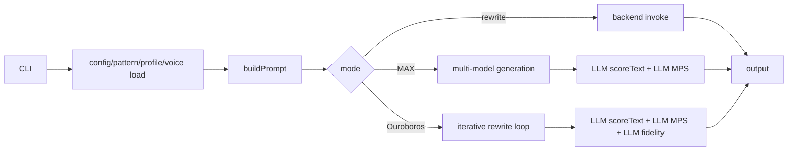
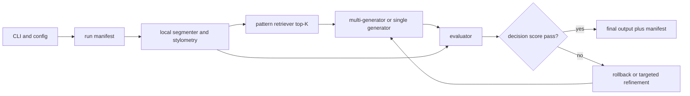

# patina 저장소 심층 분석 보고서

## 경영진 요약

`devswha/patina`는 방향이 분명한 저장소다. 패턴 기반으로 AI 글쓰기 흔적을 탐지하고, 감사 가능한 방식으로 다시 쓰기를 수행하며, 한국어·영어·중국어·일본어에 대해 총 126개 패턴을 운영한다. 공개 문서와 코드 기준으로 보면, 이 도구는 standalone Node CLI이자 entity["company","Anthropic","ai company"] Claude Code·entity["company","OpenAI","ai company"] Codex CLI 계열 워크플로에 연결되는 스킬형 도구로 설계되어 있고, rewrite·audit·score·diff·ouroboros·MAX 실행 경로를 이미 갖추고 있다. 또한 backend와 provider를 분리했고, 패턴 팩·프로필·voice·scoring 문서를 프롬프트에 명시적으로 주입하는 구조라 추적 가능성도 좋다. citeturn18view0turn18view1turn26view6turn15view0turn14view2turn23view13

하지만 현재 구현의 가장 큰 병목은 “패턴 기반”이라는 제품 포지셔닝에 비해 실제 판단의 핵심이 LLM 호출에 과도하게 묶여 있다는 점이다. README는 점수식이 deterministic이고 LLM severity assignment만 확률적이라고 설명하지만 동시에 런 간 ±8–10점 변동이 있음을 인정한다. 코드에서도 `scoreText`, `scoreMPS`, `scoreFidelity`가 모두 별도 LLM 판단에 의존하고, JSON 파싱 실패 시 `null` 또는 raw text로 조용히 떨어지며, 온도도 0이 아니라 0.1이다. 결과적으로 정확도, 재현성, 비용, 지연시간이 한 번에 흔들린다. citeturn18view3turn25view4turn25view5turn25view6turn25view7

가장 시급한 문제는 두 군데다. 첫째, MAX 모드는 후보를 여러 모델로 생성한 뒤도 평가를 `models[0]` 하나로 다시 수행하며, 원문도 `prompt.split('## Input Text')[1]`로 역추출한다. 둘째, Ouroboros는 `combinedScore`를 계산하지만 실제 중단·rollback 판단은 거의 `currentScore`와 단순 floor 규칙에 의해 결정된다. 즉, 좋은 평가 신호를 계산해 놓고도 제어 로직은 덜 정교한 신호에 매여 있다. citeturn28view1turn28view3turn27view1turn27view5turn13view4

우선순위는 명확하다.  
첫째, **평가기 분리와 원문 전달 경로 정리**가 P0다.  
둘째, **구조화 출력과 스키마 검증**이 P0다.  
셋째, **패턴 카탈로그의 데이터화와 selective retrieval**이 P0다.  
넷째, **다국어 로컬 stylometry·lexicon 계층**이 P0다.  
이 네 가지를 먼저 넣으면 정확도와 강건성은 올라가고, 프롬프트 길이와 비용은 내려갈 가능성이 가장 크다. 그 다음 단계로 scoring/MPS/fidelity 재보정, backend hardening, 테스트·벤치마크 체계, 비밀키·CLI UX·재현성 패키지를 붙이는 것이 합리적이다. citeturn26view6turn18view0turn18view4turn25view5turn25view6turn45view0turn45view5

## 현재 구조와 관찰된 강점

현재 CLI의 메인 실행 경로는 비교적 단순하다. `src/cli.js`는 provider를 선택하고, config를 로드한 뒤, 언어별 패턴 팩과 profile, `core/voice.md`, `core/scoring.md`를 읽어서 단일 프롬프트를 만들고, 그 결과를 일반 rewrite 경로, MAX 경로, Ouroboros 경로 중 하나로 보낸다. backend는 `openai-http`와 `codex-cli` 두 가지이며, provider preset은 openai, gemini, groq, together 네 개를 갖고 있다. 기본 배포는 Node 18 이상, 런타임 의존성은 `js-yaml` 하나뿐이라 구조 자체는 가볍다. citeturn9view6turn15view0turn14view2turn14view6turn44view0turn44view2turn44view3

패턴 로딩과 프롬프트 구성도 일관성은 있다. `buildPrompt`는 로드된 각 패턴 팩을 `## Pattern Packs` 아래에 그대로 붙이고, 그 뒤에 profile, voice, scoring algorithm, 모드별 instructions, input text를 이어 붙인다. rewrite 모드는 구조 패턴을 다루는 Phase 1, 어휘·문체 패턴을 다루는 Phase 2, 의미 보존과 polarity inversion 등을 다시 보는 Phase 3 self-audit로 나뉜다. config는 언어별 자동 패턴 팩 발견, `skip-patterns`, `blocklist`, `allowlist`, Ouroboros weight/threshold를 이미 지원한다. citeturn26view6turn26view0turn26view1turn26view2turn23view5turn23view6turn23view7turn23view8turn23view9turn23view10

이 구조의 강점은 “감사 가능성”이다. audit 모드는 pattern ID와 name을 정확히 쓰라고 강제하고, category도 로드된 패턴 팩 이름을 그대로 쓰게 한다. 즉, black-box paraphraser가 아니라 “어떤 규칙을 근거로 고쳤는지”를 역추적하기 쉬운 설계다. 또 backend/provider를 분리해 API key가 없을 때 codex-cli로 자동 fallback하는 부분도 실제 사용자 관점에서는 마찰을 줄인다. citeturn26view3turn26view4turn15view0turn45view0

다만 이 그림이 보여주듯, 현재 runtime의 “판단” 계층은 거의 전부 LLM 호출 위에 놓여 있다. 따라서 구조적 명료성은 있지만, 판정 안정성은 아직 소프트웨어적으로 충분히 고정되어 있지 않다. 이 점이 이후 개선안의 핵심 전제다. citeturn25view4turn25view5turn25view6turn27view5turn28view1

## 차원별 핵심 진단

| 차원 | 현재 상태 | 왜 문제인가 |
| --- | --- | --- |
| CLI | 현재 공개 help와 파서에는 `--lang`, `--profile`, `--diff`, `--audit`, `--score`, `--ouroboros`, `--batch`, `--in-place`, `--suffix`, `--outdir`, `--models`, `--model`, `--api-key`, `--base-url`, `--backend`, `--provider`가 보이지만, `--config`, `--patterns-dir`, `--profiles-dir`, `--lexicon-dir` 같은 커스텀 경로 플래그는 없다. | 사용자별 패턴/프로필/사전 자산을 붙이는 UX가 약하고, parser가 수동 `switch` 구조라 플래그 추가 때 누락 위험도 크다. citeturn45view0turn45view1turn45view5turn45view6 |
| prompt-builder | 모든 로드된 패턴 팩 본문을 프롬프트에 그대로 삽입한다. 패턴은 4개 언어 126개이며, 패턴 디렉터리도 언어×카테고리로 전부 분리돼 있다. | 감사성은 높지만 prompt token 비용이 팩 수에 거의 선형으로 늘어난다. 또한 “실제로 필요한 패턴만 골라 읽는” retrieval 계층이 없다. citeturn18view0turn20view0turn26view6 |
| scoring | `scoreText`는 category weight와 점수식 설명을 프롬프트에 넣고 LLM에게 strict JSON을 요구하지만, 실패하면 `overall: null`로 떨어진다. | 점수화의 핵심이 LLM severity assignment에 의존하고, 포맷 실패가 조용히 삼켜져 강건성이 약하다. README도 런 간 ±8–10점 변동을 인정한다. citeturn25view4turn25view7turn18view3 |
| MPS/fidelity | MPS는 `(pass_rate×0.6 + polarity_preserved×0.4)×100`이고, fidelity는 claim/no-fabrication/tone + 길이 bucket을 12점 만점으로 환산한다. 길이 bucket은 문자 길이 비율 중심이다. | 의미 보존 판단이 수치·날짜·고유명사·조건절 같은 고위험 anchor를 충분히 분리하지 못할 수 있고, 문자 길이 비율은 CJK나 압축적 문체에서 왜곡되기 쉽다. citeturn25view5turn25view6turn25view7 |
| combined score | `combinedScore`는 `ai-likeness`와 `100-fidelity`를 가중합으로 계산하며 profile별 weight도 config에 있다. | 계산해 놓고도 현재 제어 로직에서 핵심 decision variable로 쓰이지 않는다. design intent와 runtime control이 어긋나 있다. citeturn13view4turn23view10turn27view5 |
| MAX orchestration | MAX는 각 후보를 생성한 뒤 `scoreText`와 `scoreMPS`를 모두 `models[0]`으로 재채점하고, MPS 원문은 `prompt.split('## Input Text')[1]`로 뽑는다. | 평가 편향과 파싱 취약성이 동시에 존재한다. 생성 모델이 여러 개인데 평가기가 사실상 하나이며, source text 전달도 brittle하다. citeturn28view1turn28view3 |
| Ouroboros | Ouroboros는 target score, plateau, fidelity floor, MPS floor, rollback을 갖고 있지만, 중단 판단은 `currentScore`, `delta`, floor 위주다. `combined`는 로그에만 남는다. | iterative refinement를 하면서도 실제 결정은 단순 AI-likeness 중심이라, 의미 보존과 자연스러움 사이 균형을 충분히 활용하지 못한다. citeturn14view8turn27view0turn27view3turn27view5 |
| multilingual | 패턴 카탈로그는 4개 언어를 지원하지만, README의 stylometric/AI-lexicon 설명은 EN 88개, KO 102개, ZH/JA 각 60개를 명시한다. | zh/ja에 대해 pattern 지원은 있어도 stylometry/lexicon calibration은 약할 가능성이 높다. 특히 paraphrase·translation·summarization처럼 semantic-invariant 과제는 탐지가 더 어렵다는 외부 연구와도 맞물린다. citeturn18view0turn18view4turn33view1 |
| testing/CI | `npm test` 엔트리포인트는 현재 `node --test tests/e2e/*.test.js`만 가리킨다. | e2e 중심 smoke는 가능해도, 점수식·파서·패턴 스키마·Unicode edge case를 잡는 unit/property/quality benchmark 층이 약하다. citeturn44view0turn44view1 |
| security | 공개 help는 `--api-key <key>`와 여러 provider 환경변수를 직접 안내한다. | 명령행 인자는 shell history나 process list에 노출될 수 있어 비밀정보 전달 수단으로 바람직하지 않다. GitHub 문서와 CWE도 command line 전달을 피하라고 권고한다. citeturn45view0turn45view1turn41search1turn41search3 |
| reproducibility/UX | 현재 help에는 `--json`, `--save-run`, prompt hash, manifest, config hash 같은 실험 기록 옵션이 보이지 않는다. | README가 score variance를 인정하고 있어도 사용자가 어떤 model/provider/pattern set으로 결과가 나왔는지 재현하기 어렵다. 또한 MAX의 model naming과 provider naming 체계가 분리돼 초심자에게 혼동을 줄 수 있다. citeturn18view3turn23view13turn45view0turn45view1 |

## 우선순위 개선안

### 평가기 분리와 원문 전달 경로 정리

**설명**  
현재 MAX는 후보 생성 후 평가를 `models[0]` 하나로 다시 수행하고, 원문은 `prompt.split('## Input Text')[1]`로 되짚어 쓴다. Ouroboros도 rewrite에 사용한 것과 동일한 `model`을 scoring/MPS/fidelity 판단에 재사용한다. 이 구조는 평가 편향, brittle parsing, self-grading 과신을 한꺼번에 만든다. citeturn28view1turn28view3turn27view1

**기술 접근**  
`src/cli.js`에서 `sourceText`와 `evaluator` 설정을 `runMaxMode`·`runOuroboros`에 명시적으로 전달하고, `src/max-mode.js`에서는 `prompt.split`을 제거해 원문을 직접 받도록 바꿔야 한다. `src/ouroboros.js`와 `src/scoring.js`에는 생성 모델과 독립적인 evaluator model/provider를 넣고, 가능하면 로컬 feature gate를 먼저 통과한 후보만 evaluator에게 보내는 2단계 구조가 좋다. iterative self-feedback 자체는 Self-Refine와 Reflexion류 연구에서 효과가 있었지만, 외부 검증기 없이 자기비평만 믿는 구조는 신뢰성이 떨어질 수 있다는 반론 연구도 있다. patina는 “외부 검증기 우선, 자기비평 보조”로 설계하는 편이 더 안전하다. citeturn35search0turn34search0turn35search3

**수정 파일**  
`src/cli.js`, `src/max-mode.js`, `src/ouroboros.js`, `src/scoring.js`, `.patina.default.yaml`

**구현 난이도**  
M

**기대 효과**  
정확도 상승, 의미 보존 안정화, MAX 선택 편향 감소, 파싱 취약성 제거

**리스크와 트레이드오프**  
평가 모델을 분리하면 비용은 늘 수 있다. 다만 evaluator를 경량 모델이나 로컬 검사와 조합하면 총비용 증가를 통제할 수 있다.

**우선순위**  
P0

### 구조화 출력과 스키마 검증 계층 도입

**설명**  
현재 scoring 계열 함수는 “strict JSON”을 요구하지만 실제로는 자유 텍스트를 받아 `extractJson`으로 잘라낸 뒤 `JSON.parse`하고 실패 시 `null`로 떨어진다. 이는 실패를 조용히 숨기는 방식이라, 운영 환경에서 partial failure를 탐지하기 어렵다. citeturn13view0turn25view4turn25view5turn25view6

**기술 접근**  
핵심은 `src/api.js`와 `src/scoring.js`에 schema-first 계층을 넣는 것이다. 지원 모델에는 OpenAI Structured Outputs 스타일의 JSON schema 응답을 사용하고, provider가 이를 완전히 보장하지 못할 때는 `Ajv`로 런타임 검증·coercion·error surface를 통일하면 된다. `Ajv`는 JSON schema를 빠른 JS validator로 컴파일하고 캐시하므로 patina처럼 반복적으로 동일 schema를 쓰는 케이스에 적합하다. malformed output은 `p-retry`로 짧게 재시도하고, 최종 실패는 “점수 없음”으로 삼키지 말고 명시적 오류 타입으로 올려야 한다. OpenAI 문서도 JSON mode보다 Structured Outputs를 권장하고, schema adherence와 refusal detection을 분리해 다루라고 안내한다. citeturn40search0turn40search1turn40search2turn38search4turn38search5turn37search0

**수정 파일**  
`src/api.js`, `src/scoring.js`, `src/providers.js`, `src/schemas/score.js`, `src/schemas/mps.js`, `src/schemas/fidelity.js`

**구현 난이도**  
M

**기대 효과**  
강건성 상승, 포맷 오류 추적 가능, 재현성 개선, 디버깅 시간 감소

**리스크와 트레이드오프**  
provider별 structured output 지원 수준이 다르다. 따라서 “provider capability map + Ajv fallback” 이중 구조가 필요하다.

**우선순위**  
P0

### 패턴 카탈로그를 데이터화하고 selective retrieval로 전환

**설명**  
지금 patina의 패턴 카탈로그는 수량과 언어 범위 면에서는 강하다. 하지만 runtime 관점에서는 “필요한 패턴 검색”이 아니라 “로딩된 패턴 팩 전체 삽입” 모델에 가깝다. 이 방식은 문서가 길수록 prompt 비용과 latency를 키운다. citeturn18view0turn20view0turn26view6

**기술 접근**  
각 `patterns/*.md`에 `id`, `lang`, `category`, `signals`, `examples`, `counterexamples`, `severity`, `profiles`, `locale-notes` 같은 frontmatter를 추가하고, `src/loader.js`에서 이를 읽어 `src/pattern-index.js`로 inverted index를 만든 뒤 top-K retrieval을 해야 한다. retrieval은 처음부터 복잡한 vector search일 필요가 없다. 로컬 lexicon hit, punctuation/style cue, discourse marker, short regex set, profile/language prior를 합친 BM25 유사 스코어면 충분하다. `src/prompt-builder.js`는 “전체 팩”이 아니라 “선정된 패턴 + 카테고리별 최소 커버리지”만 넣고, 부족하면 second pass를 수행하도록 바꾸는 게 좋다. 이 변경은 패턴 품질 관리에도 도움이 된다. 패턴 검증용 `tools/validate-patterns.mjs`를 만들면 누락된 ID, 중복 번호, 잘못된 카테고리, 번역 품질 저하를 CI에서 잡을 수 있다. citeturn26view6turn23view6turn23view7turn23view8

**수정 파일**  
`patterns/*.md`, `src/loader.js`, `src/prompt-builder.js`, `src/pattern-index.js`, `tools/validate-patterns.mjs`

**구현 난이도**  
M

**기대 효과**  
지연시간 감소, 비용 절감, 패턴 품질 관리 향상, 프롬프트 집중도 향상

**리스크와 트레이드오프**  
retriever recall이 낮으면 중요한 패턴을 놓칠 수 있다. 이를 막으려면 category floor와 fallback second pass가 필요하다.

**우선순위**  
P0

### 다국어 로컬 stylometry·lexicon 계층 구축

**설명**  
README는 stylometric pre-pass로 burstiness CV와 MATTR, AI-lexicon overlap을 설명하지만, 공개 설명 기준 lexicon 수치는 EN/KO만 선명하게 제시된다. 반면 패턴은 4개 언어를 지원한다. 이는 zh/ja에서 “패턴 catalog는 넓지만 style signal은 상대적으로 얕은” 비대칭을 강하게 시사한다. 또 HC3 Plus는 요약·번역·패러프레이즈 같은 semantic-invariant 과제가 탐지를 더 어렵게 만든다고 보여준다. patina는 바로 그런 rewrite 환경에 놓이는 도구다. citeturn18view4turn18view0turn33view1

**기술 접근**  
`src/features/segment.js`를 새로 만들고 `Intl.Segmenter`가 있으면 locale-sensitive word/sentence segmentation을 사용하되, 없으면 fallback을 두는 식으로 구현하는 것이 가장 가볍다. 그 위에 `src/features/stylometry.js`에서 MATTR, sentence-length CV, punctuation entropy, discourse-opener repetition, parenthesis/em-dash density, hedge/disclaimer density, function-word ratio를 계산하고, `src/features/lexicon.js`에서 ko/en/zh/ja 전부의 AI-lexicon과 domain/profile allowlist를 관리하면 된다. 더 나아가 ambiguous case에만 `onnxruntime-node` 기반의 소형 다국어 classifier를 붙이면 rule-only보다 높은 정확도를 기대할 수 있다. 외부 연구도 DetectGPT와 Binoculars처럼 pure prompting이 아닌 별도 statistical/model-based signal이 zero-shot detection에 효과적일 수 있음을 보여준다. citeturn42search4turn42search3turn43search0turn43search2turn33view3turn32view1turn32view0

**수정 파일**  
`src/features/segment.js`, `src/features/stylometry.js`, `src/features/lexicon.js`, `lexicon/ko*.txt`, `lexicon/en*.txt`, `lexicon/zh*.txt`, `lexicon/ja*.txt`, 필요시 `models/detector.onnx`

**구현 난이도**  
L

**기대 효과**  
다국어 정확도 상승, LLM 의존도 감소, 비용 절감, score variance 축소

**리스크와 트레이드오프**  
로컬 모델을 넣으면 배포 크기와 설치 복잡도가 증가한다. 따라서 “rule/stylometry 먼저, ONNX는 optional” 경로가 적절하다.

**우선순위**  
P0

### scoring·MPS·fidelity 알고리즘 재보정과 제어 로직 일치화

**설명**  
현재 MPS와 fidelity는 구조가 단순하고 이해하기 쉽다는 장점이 있지만, 실제 rewrite 품질에서 중요한 숫자·날짜·고유명사·인과·조건절 보존을 충분히 세분화하지 않는다. 게다가 `combinedScore`가 계산되는데도 control loop는 사실상 `currentScore` 중심으로 돈다. 이건 코드가 이미 더 좋은 신호를 계산하고도 활용하지 못한다는 뜻이다. citeturn25view5turn25view6turn13view4turn27view5

**기술 접근**  
`src/scoring.js`에서 MPS를 “anchor type별 weighted preservation”으로 바꾸는 것이 좋다. 최소한 entity, number/date, polarity, causation, conditional, domain term을 분리해야 한다. fidelity의 길이 항목도 문자 길이 ratio 대신 segment/token ratio로 바꾸고, contradiction penalty를 따로 두는 편이 낫다. 그리고 `src/ouroboros.js`는 중단 기준을 `decisionScore = α·AI + β·(100-fidelity) + γ·semanticRisk` 같은 형태로 바꿔야 한다. MAX의 tie-break 역시 “MPS 통과 후보 중 최소 AI”보다 “decisionScore 최소”가 더 일관된다. 외부 데이터셋은 HC3와 HC3 Plus를 baseline으로 쓰고, patina의 자체 500-paragraph calibration corpus를 언어·도메인별로 확장해 profile별 threshold를 다시 맞추는 게 바람직하다. citeturn33view0turn33view1turn18view4

**수정 파일**  
`src/scoring.js`, `src/ouroboros.js`, `src/max-mode.js`, `.patina.default.yaml`, `.omc/research/*`

**구현 난이도**  
L

**기대 효과**  
정확도 상승, 의미 왜곡 감소, profile/language별 calibration 향상

**리스크와 트레이드오프**  
평가식이 복잡해지면 해석성이 떨어질 수 있다. 그래서 최종 출력에는 각 항목별 subscore와 penalty reason을 반드시 남겨야 한다.

**우선순위**  
P1

### backend/provider 계층 하드닝과 비용 제어

**설명**  
patina는 backend와 provider를 분리한 점은 좋지만, 공개된 코드만 보면 retry/backoff/concurrency budget/cost budget 같은 운영 보호장치가 충분히 노출되어 있지 않다. MAX는 여러 모델을 동시에 던지는 구조라 provider별 실패율과 지연 편차를 그대로 맞게 된다. citeturn15view0turn14view2turn14view6turn28view1

**기술 접근**  
가장 현실적인 접근은 `src/api.js`에서 Node의 built-in fetch 경로를 유지하되, `AbortController`, `p-limit`, `p-retry`를 얹는 것이다. Node 문서에 따르면 fetch는 Undici 기반이므로 굳이 무거운 HTTP client를 추가하지 않아도 된다. 여기에 `src/providers.js`에 capability map을 넣어 “structured output 지원 여부, timeout, retryable status, free-tier 특성, max concurrency, cost metadata”를 명시하면 된다. 사용자는 `--max-concurrency`, `--budget-tokens`, `--budget-cost`, `--fail-open`, `--fail-closed` 같은 운영 플래그를 통해 성능과 품질을 조절할 수 있다. `p-limit`는 동시 실행 수 관리에, `p-retry`는 지수 backoff와 abort signal 처리에 적합하다. citeturn36search5turn37search1turn37search0

**수정 파일**  
`src/api.js`, `src/providers.js`, `src/backends/index.js`, `src/max-mode.js`, `src/cli.js`

**구현 난이도**  
M

**기대 효과**  
지연시간 tail 감소, rate-limit 내성 증가, 비용 예측 가능성 향상

**리스크와 트레이드오프**  
운영 플래그가 많아지면 UX가 무거워질 수 있다. 기본 preset을 잘 잡아야 한다.

**우선순위**  
P1

### 테스트·CI·품질 벤치마크 계층 확장

**설명**  
현재 `npm test`는 `tests/e2e/*.test.js`만 대상으로 한다. 이 자체가 나쁘다는 뜻은 아니지만, 지금 patina가 안고 있는 위험은 e2e smoke만으로 잡기 어렵다. parser edge case, Unicode segmentation, score schema drift, rollback invariant, pattern metadata 품질은 unit/property/benchmark 계층이 필요하다. citeturn44view0turn44view1

**기술 접근**  
Node의 내장 `node:test`는 유지하되, 세 층을 추가하는 것이 맞다. `tests/unit`에는 parseArgs/config precedence/scoring formula/pattern schema test를 넣고, `tests/property`에는 `fast-check`로 “임의 Unicode 입력에서도 crash하지 않는다”, “mock backend에서 score JSON은 항상 schema를 만족한다”, “rollback 후 점수와 원문 연결성이 보존된다” 같은 invariant를 돌린다. `tests/quality`에는 HC3, HC3 Plus, repo calibration corpus, 내부 ko/ja/zh/en human/AI pairs를 넣고 AUROC, TPR@1% FPR, false positive on human prose, MPS/fidelity 평균, human blind preference를 측정해야 한다. GitHub Actions는 Node 18/20/22 matrix와 mock/live-smoke를 분리해 운영하는 편이 좋다. `fast-check`는 seed 기반 reproducibility를 지원해 flaky test에도 유리하다. citeturn36search0turn36search2turn36search4turn33view0turn33view1

**수정 파일**  
`package.json`, `.github/workflows/ci.yml`, `tests/unit/**`, `tests/property/**`, `tests/quality/**`, `artifacts/**`

**구현 난이도**  
M

**기대 효과**  
회귀 방지, score drift 조기 탐지, 릴리스 신뢰성 향상

**리스크와 트레이드오프**  
quality benchmark 구축에는 데이터 정제 비용이 든다. 그러나 이 투자가 없으면 scoring/MPS 조정의 효과를 검증할 방법이 없다.

**우선순위**  
P1

### 비밀키 처리, 커스텀 경로 UX, 실행 산출물 재현성 패키지

**설명**  
현재 help는 `--api-key <key>` 사용을 직접 노출하고, 환경변수도 여러 provider 키를 나열한다. 동시에 사용자가 커스텀 config/path를 넘기거나, 실행 결과를 manifest로 저장하는 옵션은 공개 help에서 보이지 않는다. model/provider naming도 single-model path와 MAX path 사이에 분리돼 초심자 입장에서 혼동 여지가 있다. citeturn45view0turn45view1turn23view13

**기술 접근**  
보안 측면에선 `--api-key`를 즉시 제거할 필요는 없지만, 기본 권장 흐름은 `--api-key-stdin` 또는 `PATINA_API_KEY_FILE`로 전환해야 한다. GitHub 문서와 CWE는 command line을 통한 secret 전달을 피하라고 명시한다. UX 측면에선 Node 18 compatibility를 유지하려면 최신 Commander보다 `yargs`가 더 안전하다. `yargs`는 명령·옵션·help generation이 강하고, 현재 수동 parser를 대체하기 좋다. `src/cli.js`, `src/config.js`, `src/loader.js`, `src/output.js`에 `--config`, `--patterns-dir`, `--profiles-dir`, `--lexicon-dir`, `--voice-file`, `--json`, `--save-run`을 추가하고, 실행 후에는 `manifest.json`에 package version, repo SHA, config hash, prompt hash, selected patterns, provider/model, token usage, score breakdown, evaluator 정보를 남기는 것이 좋다. Commander 최신판은 Node 20+를 요구하는 반면, 현재 patina는 Node >=18을 목표로 한다는 점도 `yargs` 쪽이 더 맞는 이유다. citeturn41search1turn41search3turn39search1turn38search3turn44view3

**수정 파일**  
`src/cli.js`, `src/config.js`, `src/loader.js`, `src/output.js`, `AUTHENTICATION.md`, `README.md`

**구현 난이도**  
M

**기대 효과**  
보안 향상, 사용자 설정 유연성 증가, 디버깅/재현성 개선

**리스크와 트레이드오프**  
CLI 파서 전환은 호환성 문제가 생길 수 있다. 최소 1개 릴리스 동안 deprecated alias를 유지하는 것이 좋다.

**우선순위**  
P1

## 로드맵과 검증 계획

현재 구조를 유지하면서도 품질을 빠르게 올리려면, “모듈 교체”보다 “판단 계층 분리 → 출력 강제화 → 패턴/특징 검색화” 순서로 가는 편이 맞다. 외부 연구를 보면 iterative refinement 자체는 분명 가치가 있지만, self-critique만으로는 회귀를 막기 어렵다. 그래서 patina의 다음 버전은 “한 번 더 잘 쓰게 만드는 시스템”이 아니라 “잘못된 후보를 가려내고 설명 가능한 근거로 통과시키는 시스템”으로 이동해야 한다. citeturn35search0turn34search0turn35search3turn32view0turn32view1

### 권장 일정

| 기간 | 마일스톤 | 핵심 산출물 |
| --- | --- | --- |
| 1주–2주 | 정확도·강건성 긴급 보강 | evaluator 분리, `sourceText` 직접 전달, structured output schema, malformed output retry, MAX/Ouroboros 회귀 테스트 |
| 3주–5주 | 비용·다국어 품질 개선 | pattern metadata schema, top-K retrieval, ko/en/zh/ja lexicon 정비, 로컬 stylometry feature extractor, decision score 재설계 |
| 6주–8주 | 운영 품질 고도화 | provider capability map, concurrency/cost budget, property-based tests, quality benchmark, `--config`·`--save-run`·`--api-key-stdin` 도입 |

### 권장 검증 세트

| 계층 | 테스트 항목 | 지표 |
| --- | --- | --- |
| unit | parseArgs, config precedence, pattern schema, score formula, rollback invariant | pass rate 100%, snapshot diff 0 |
| property | 임의 Unicode 입력, 랜덤 파일 배치, malformed model output, random allow/blocklist 조합 | no-crash, schema validity, shrinkable counterexample |
| e2e | rewrite/audit/score/diff/ouroboros/MAX를 mock backend와 live smoke로 실행 | success rate, JSON failure rate, rollback rate |
| quality benchmark | HC3, HC3 Plus, repo calibration corpus, 내부 ko/ja/zh/en paired set | AUROC, macro-F1, TPR@1% FPR, human prose FP, MPS, fidelity, blind human preference |
| performance/cost | 짧은 문서·긴 문서·배치 처리·MAX 병렬 처리 | p50/p95 latency, input/output tokens, cost per 1k chars, retries per request |
| reproducibility | 동일 config/model/seed로 5회 반복 | score variance, selected-pattern stability, manifest completeness |

### 권장 데이터셋과 기준선

QC용 외부 벤치마크는 최소 HC3와 HC3 Plus를 포함해야 한다. HC3는 human-vs-ChatGPT 비교 코퍼스라 탐지 baseline으로 유용하고, HC3 Plus는 summarization·translation·paraphrasing 같은 semantic-invariant task를 포함해 patina의 실제 사용 맥락과 더 가깝다. 여기에 README가 언급하는 repo 내부 500-paragraph calibration corpus를 언어·도메인별로 재정비해 쓰면 된다. 특히 법률·의학·기술문서·SNS 글처럼 profile별 문체 차이가 큰 텍스트를 분리해야 threshold와 false positive를 제대로 잡을 수 있다. citeturn33view0turn33view1turn18view4

### 최종 우선순위 제안

실제로 한 번에 다 하지 말고, 다음 순서로 자르는 것이 가장 효율적이다.

먼저 **P0 네 가지**를 한다. 평가기 분리, structured outputs, pattern retrieval, 로컬 multilingual stylometry다. 이 단계가 끝나면 patina는 “LLM에게 다 맡기는 humanizer”에서 “로컬 신호와 외부 평가기를 결합하는 hybrid editor”로 바뀐다. 그 다음에 scoring/MPS/fidelity 재보정과 backend hardening을 붙이면 정확도와 비용이 같이 안정된다. 마지막으로 테스트·CI·secrets·custom path·manifest를 정리하면 운영 가능한 도구가 된다. 지금 저장소는 이미 좋은 문제정의와 패턴 자산을 갖고 있으므로, 핵심은 새 기능을 더하는 것보다 **판단·검증·기록 계층을 소프트웨어적으로 고정하는 것**이다. citeturn18view0turn26view6turn25view4turn25view5turn25view6