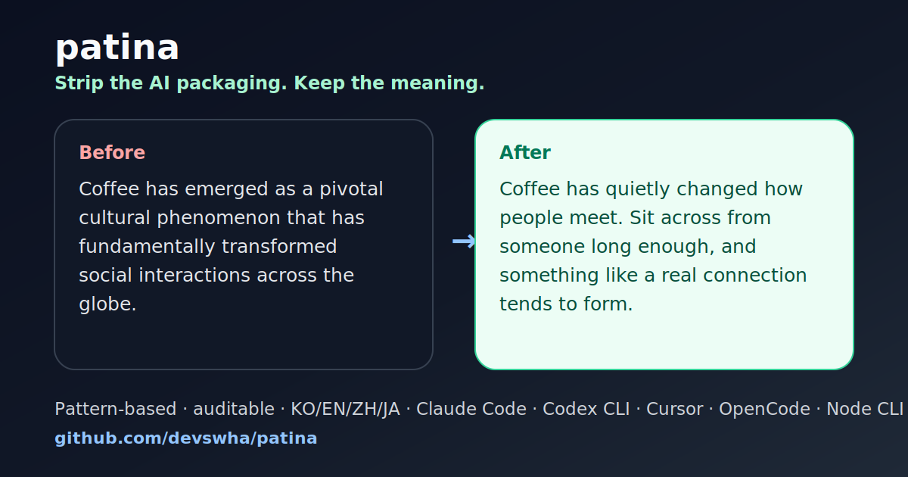

# patina viral launch kit

This is a ready-to-use launch pack for sharing patina without sounding like a
vendor announcement. The hook is always the same: show the AI-sounding text,
then show the cleaner version beside it.

## Positioning

Use this one-liner when space is tight:

> patina strips the AI packaging from a draft while keeping the claim, numbers,
> polarity, and causation intact.

Do not lead with "humanizer" alone. It attracts the wrong detector-bypass frame.
Lead with auditable editing and meaning preservation.

## Share card

Use the repository card when posting a short before/after:



## X / Threads posts

### Short before/after

```text
AI draft:
"Coffee has emerged as a pivotal cultural phenomenon that has fundamentally transformed social interactions across the globe."

patina:
"Coffee has quietly changed how people meet. Sit across from someone long enough, and something like a real connection tends to form."

Same claim. Less packaging.
https://github.com/devswha/patina
```

### Developer angle

```text
I don't want an AI detector bypass.
I want an editor that says: this sentence smells generated, this phrase is doing too much, and this rewrite kept the original claim.

That's what patina is trying to be.
https://github.com/devswha/patina
```

### CLI angle

```text
Tiny CLI test:

printf '%s\n' 'Coffee has emerged as a pivotal cultural phenomenon.' \
  | npx patina-cli --lang en --backend codex-cli

patina rewrites the prose, but tracks meaning-preservation instead of doing a blind paraphrase.
https://github.com/devswha/patina
```

### Korean post

```text
AI 글 냄새는 보통 내용보다 포장지에서 난다.
"획기적인", "근본적으로", "시너지", "중요한 이정표" 같은 말들.

patina는 그 포장지를 벗기고 주장/숫자/부정/인과는 그대로 두는 쪽을 목표로 만든 도구다.
https://github.com/devswha/patina
```

## Reddit / Hacker News style comment

```text
I built patina because most "humanizer" tools feel like black-box paraphrasers.
This one is pattern-based and auditable: it flags AI-sounding phrasing, rewrites
only the prose, and tries to preserve claims, numbers, polarity, and causation.

The browser playground is audit-only, so you can paste text and see the signals
without sending it to an LLM. The CLI/agent skill can rewrite when you want it to.

Repo: https://github.com/devswha/patina
```

## README / landing checklist

When a post starts getting traffic, make sure the landing surface answers these
within the first screen:

- what changes: before/after example
- what does not change: claim, numbers, polarity, causation
- where to try it without installing: browser audit
- where to install it: Claude Code plugin or `npx patina-cli`
- what it is not: authorship detector or detector-bypass service

## Posting rules

Post examples, not feature lists. A good post has one input, one output, and one
line about why the output is better.

Avoid exaggerated metrics, fake urgency, and engagement bait. patina's believable
angle is restraint: it removes over-produced phrasing instead of promising magic.
